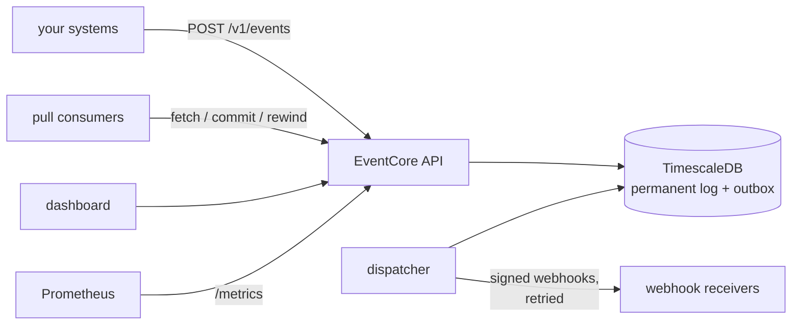

# EventCore

**Your system's memory, and its megaphone.** EventCore is a self-hosted event
audit log with reliable, signed webhook delivery — send your application's
events over HTTP and EventCore records them durably, makes them queryable,
and pushes them to every consumer that depends on them, retrying until
they arrive.

[](https://github.com/sharanggupta/eventcore/actions/workflows/ci.yml)

Webhook gateways keep your payloads for 3–90 days and meter every event;
audit-log SaaS charges per event *retained, forever*. EventCore is both halves
in one small system you own: a **permanent event record** and a **delivery
pipeline**, open source with no held-back features, at rest on your own
hardware.

## Features

**Record** — events land in a TimescaleDB hypertable via `POST /v1/events`;
query newest-first with cursor pagination and type filtering; nothing expires
unless you say so — and when you leave, `./scripts/export.sh` hands you
everything in one restorable bundle.

**Deliver** — register webhooks and every matching event is POSTed to them,
HMAC-SHA256 signed with a per-subscription secret, retried five times with
exponential backoff from a transactional outbox that survives restarts.
Per-subscription `eventTypes` filters (updatable in place) and `payloadFields`
allow-lists — each consumer receives only the payload fields it needs.

**Replay** — pull subscriptions give any consumer a named durable cursor over
the permanent log: start from the beginning, now, or any timestamp; fetch and
commit at your own pace; a consumer built today can backfill everything that
happened before it existed. Webhook gateways that expire payloads in 3–90
days structurally cannot offer this.

**Operate** — the delivery pipeline is fully inspectable and recoverable over
the API: list the outbox, read per-attempt histories (status codes, errors,
response snippets, durations), redeliver one failed delivery or a whole
backlog with one call, and scrape `/metrics` (Prometheus) including a
per-type last-received timestamp that catches producers going silent.

**See** — a tenant dashboard ([dashboard/](dashboard)) with pipeline charts, a
browsable event log (filter, paginate, click for payloads), delivery attempt
timelines with single and bulk redelivery, webhook management (secrets
revealed once, in the UI), and per-consumer lag.

**Secure** — API keys hashed at rest, shown once, revocable instantly;
admin-token-guarded key management; deliveries verifiable by receivers.

## How it fits together



More diagrams (event lifecycle, components, data model) in
[docs/architecture.md](docs/architecture.md).

## Quick start

Prerequisites: Docker with Compose, plus `curl` and `jq` for the examples below.

```bash
git clone git@github.com:sharanggupta/eventcore.git && cd eventcore
docker compose up --build -d
curl http://localhost:8080/health   # -> OK
```

Issue a key and send your first event:

```bash
KEY=$(curl -s -X POST http://localhost:8080/v1/api-keys \
  -H 'X-Admin-Token: local-admin-token' -H 'Content-Type: application/json' \
  -d '{"name": "my-first-key"}' | jq -r .key)

curl -s -X POST http://localhost:8080/v1/events \
  -H "X-API-Key: $KEY" -H 'Content-Type: application/json' \
  -d '{"type": "user.signed_up", "payload": {"userId": "u_123"}}' | jq .
```

Then either follow the **[five-minute walkthrough](docs/walkthrough.md)**
(webhooks, signature verification, recovery — every response shown is real
captured output) or let the script prove everything at once:

```bash
./scripts/walkthrough.sh   # -> All checks passed.
```

## Repository layout

| Directory | What it is |
|---|---|
| [`backend/`](backend) | The EventCore service: Spring Boot 4 + TimescaleDB |
| [`dashboard/`](dashboard) | Tenant web dashboard (Next.js) — see the [guide](docs/dashboard.md) |
| [`examples/`](examples) | Runnable integration examples (Spring Boot, Python) |
| [`docs/`](docs) | Walkthrough, testing and developer guides, product research |
| [`scripts/`](scripts) | End-to-end walkthrough script, local webhook listener |

## Documentation

| | |
|---|---|
| [Full-system tour](docs/full-system-tour.md) | Backend + demo app + dashboard together: place an order, watch it flow |
| [Five-minute walkthrough](docs/walkthrough.md) | Copy-paste tour of every feature with real outputs |
| [Testing guide](docs/testing/README.md) | Reproducible test suite, e2e script, failure/recovery drill |
| [Architecture](docs/architecture.md) | Mermaid diagrams as code: system, event lifecycle, components, data model |
| [Developer guide](docs/development.md) | Codebase tour, request lifecycle, how to add a feature |
| [Integration examples](examples/README.md) | Runnable Spring Boot and Python apps that use EventCore end-to-end |
| [Dashboard guide](docs/dashboard.md) | The tenant web UI: run it, every screen explained |
| **Swagger UI** | `http://localhost:8080/swagger-ui.html` on any running instance (spec at `/v3/api-docs`) |
| [Market positioning](docs/product/market-positioning.md) | Cited competitor pricing and where EventCore stands |
| [Data handling & legal](docs/legal/data-handling.md) | GDPR-relevant controls, DPA/subprocessor templates, draft SLA |

## API at a glance

| Method | Path | Auth | Description |
|--------|------|------|-------------|
| GET | `/health` | none | Liveness, returns `OK` |
| GET | `/metrics` | none | Prometheus text: delivery states, backlog age, ingest totals, per-type last-received |
| POST | `/v1/api-keys` | `X-Admin-Token` | Issue an API key (plaintext shown once) |
| DELETE | `/v1/api-keys/{id}` | `X-Admin-Token` | Revoke a key immediately (record kept for audit) |
| POST | `/v1/events` | `X-API-Key` | Ingest an event (`type` required, `payload` any JSON) |
| GET | `/v1/events` | `X-API-Key` | List newest-first; `limit`, `cursor`, `type`, `from`/`to`, `payload.<field>=<value>` (dotted fields walk nesting; repeatable, AND-ed) |
| POST | `/v1/webhooks` | `X-API-Key` | Register a webhook (`secret` shown once; optional `eventTypes` filter and `payloadFields` allow-list) |
| GET | `/v1/webhooks` | `X-API-Key` | List subscriptions (never includes secrets) |
| PATCH | `/v1/webhooks/{id}` | `X-API-Key` | Update `eventTypes` in place (same id, same secret) |
| DELETE | `/v1/webhooks/{id}` | `X-API-Key` | Remove a subscription and its delivery history |
| GET | `/v1/deliveries` | `X-API-Key` | List deliveries; filter `status=pending\|delivered\|failed` |
| GET | `/v1/deliveries/{id}` | `X-API-Key` | Per-attempt history: status/error, snippet, duration |
| POST | `/v1/deliveries/{id}/redeliver` | `X-API-Key` | Fresh retry cycle for a failed delivery |
| POST | `/v1/deliveries/redeliver` | `X-API-Key` | Bulk requeue: `{"status":"failed"}` → `{"requeued":N}` |
| POST | `/v1/pull-subscriptions` | `X-API-Key` | Create a named durable cursor (`from`: `beginning`/`now`/timestamp; optional `eventTypes`) |
| GET | `/v1/pull-subscriptions/{name}/events` | `X-API-Key` | Fetch the next batch oldest-first (peek; does not advance) |
| POST | `/v1/pull-subscriptions/{name}/commit` | `X-API-Key` | Advance the cursor — crash-safe, at-least-once consumption |

Errors are always `{"error": "<what went wrong>"}` with 400/401/404/409.

## Monitoring

Scrape `GET /metrics` and alert on silence, not just errors:

```yaml
- alert: EventFlowStopped
  expr: time() - eventcore_event_last_received_timestamp_seconds > 900
  for: 5m
```

Full metric list and dead-letter alerting in the
[testing guide](docs/testing/README.md) and walkthrough.

## Configuration

Set in [.env](.env) (used by Docker Compose) or as environment variables:

| Variable | Default | Description |
|----------|---------|-------------|
| DB_NAME / DB_USER / DB_PASSWORD | eventcore | Database credentials |
| DB_PORT | 5432 | Database port |
| SERVER_PORT | 8080 | Application port |
| ADMIN_TOKEN | (unset) | Token for key management; those endpoints reject everything while unset |
| RETENTION_EVENTS_MAX_AGE | 0 (keep forever) | e.g. `90d` — old events drop by whole chunks, daily |
| RETENTION_DELIVERY_HISTORY_MAX_AGE | 0 (keep forever) | e.g. `30d` — old delivery records and attempts |

Webhook tuning (`eventcore.webhooks` in
[application.yml](backend/src/main/resources/application.yml)): `poll-interval` 1s,
`retry-backoff` 5s doubling per attempt, `max-attempts` 5.

## Free self-hosting, flat-price hosting

- **Self-hosted: free, forever, full-featured.** Apache-licensed, no
  open-core gating — the version in this repo is the whole product.
- **Managed (planned): one flat price, no per-event metering.** A dedicated
  single-tenant instance on EU infrastructure (Hetzner — GDPR-friendly,
  ISO 27001). At 1M events/month, metered competitors cluster between $189
  and $1,188/month ([evidence](docs/product/market-positioning.md)); nobody
  sells 12-month retention below ~$1,200/month. The honest unit of a flat
  price is **retention, not event count**: generous fair-use rates with a
  published rotation ladder (compress → archive → never a surprise bill,
  never blocked ingest) — the full economics are worked in
  [hosting-feasibility.md](docs/product/hosting-feasibility.md).

## Development

```bash
cd backend
./mvnw test            # 86 integration tests via Testcontainers (Docker required)
./mvnw clean package   # build the jar
```

Java 21 · Spring Boot 4 · TimescaleDB (PostgreSQL 16) · Flyway · Docker
Compose. Package-by-feature layout under
[backend/src/main/java/dev/eventcore](backend/src/main/java/dev/eventcore): `events`,
`webhooks`, `deliveries`, `security`, `metrics`, with shared `api` and
`crypto` primitives. Contributions welcome — start with the
[testing guide](docs/testing/README.md).
