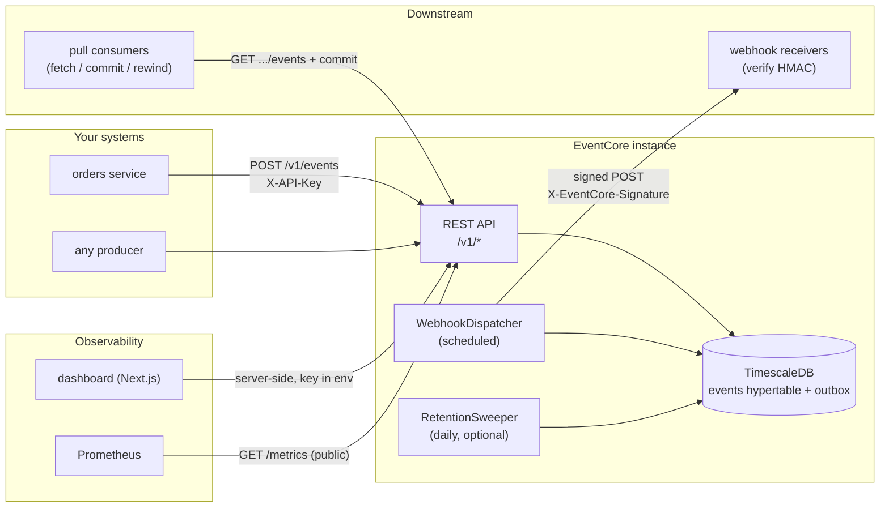
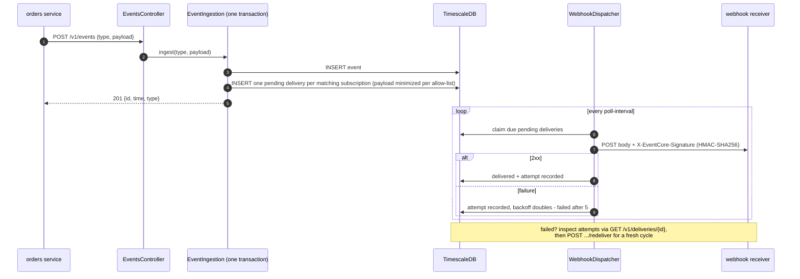
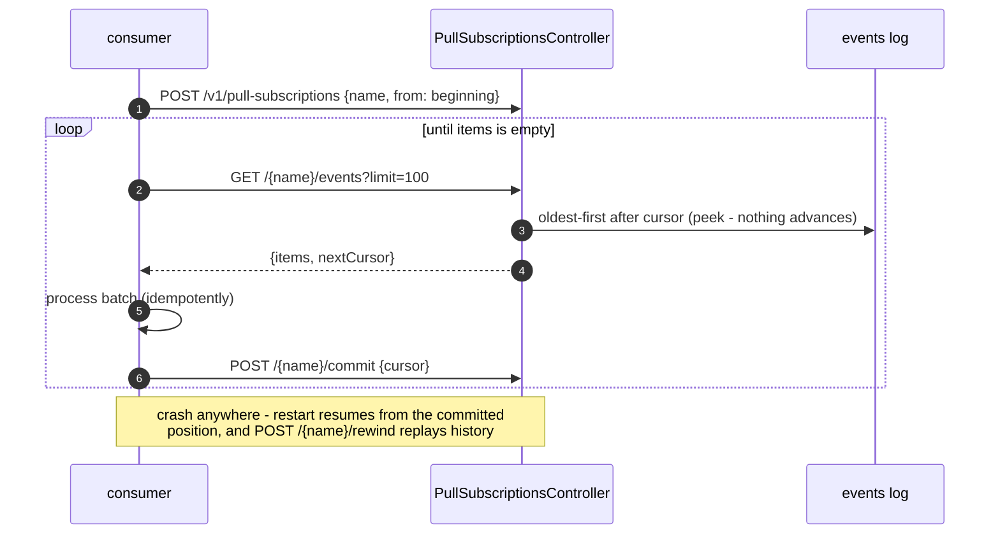
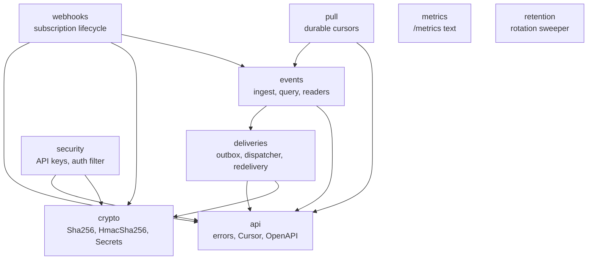
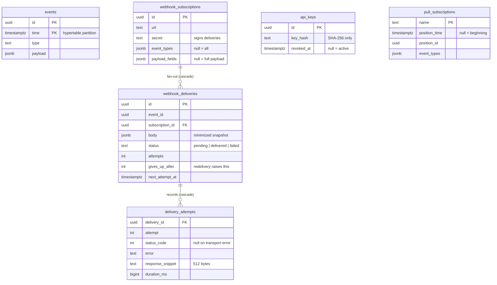
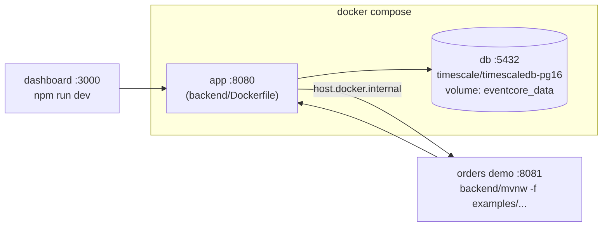

# Architecture

All diagrams on this page are [Mermaid](https://mermaid.js.org/) — plain text
in this file, rendered automatically by GitHub, versioned and reviewed like
any other code. That is the whole "architecture as code" toolchain: there is
deliberately no generation step (no Maven plugin, no image exports to drift
out of date). If a diagram is wrong, the fix is a one-line PR.

## System overview

Producers push events in; EventCore records them durably and fans them out —
push (signed webhooks, retried) and pull (durable cursors). Everything
observable reads the same API.

## The life of an event

The critical design decision is visible in the first three arrows: the event
insert and its fan-out rows are **one transaction** (the outbox pattern), so a
crash can never record an event without queueing its deliveries, or vice
versa. Delivery then happens asynchronously with retries.

## Pull consumption (replay)

Push is EventCore calling you; pull is you walking the permanent log with a
named durable cursor — at-least-once, crash-safe, rewindable.

## Backend components

Package-by-feature; arrows are the only cross-package dependencies. Shared
primitives (`api`, `crypto`) depend on nothing domain-shaped.

`events → deliveries` is the transactional fan-out; `pull → events` is the
oldest-first reader; `webhooks → events` reuses the type-filter vocabulary.

## Data model

Two deliberate non-links: `webhook_deliveries.event_id` has no foreign key
(TimescaleDB hypertables cannot be FK targets — the body snapshot makes the
delivery self-contained), and `pull_subscriptions` references the log only by
cursor position.

## Deployment (local / self-hosted)

The managed-hosting variants (instance-per-customer on Hetzner, control
plane, billing) are analyzed in
[product/deployment-architecture.md](product/deployment-architecture.md) —
pending the founder's hosting decision.
